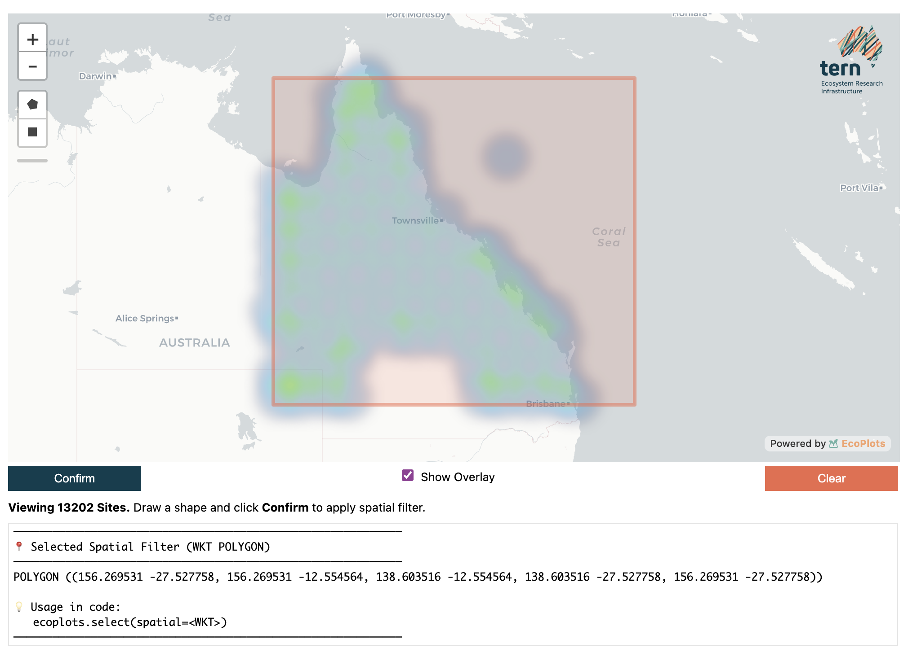

EcoPlots Observations Workflow
===============================

The ``EcoPlots`` client in **observations** mode (the default) lets you discover
and retrieve ecological observation data across Australia — including site visits,
feature types, and measured properties — all returned as tidy DataFrames ready
for analysis.

.. code-block:: python

   from terndata.ecoplots import EcoPlots

   ec = EcoPlots()                          # mode="observations" by default
   ec.select(dataset="TERN Surveillance")   # add one or more filters
   ec.preview()                             # quick look before full download
   df = ec.get_data()                       # retrieve as GeoDataFrame

.. note::

   All methods on this page are available on both
   :class:`~terndata.ecoplots.ecoplots.EcoPlots` (synchronous) and
   :class:`~terndata.ecoplots.ecoplots.AsyncEcoPlots` (asynchronous).
   For ``AsyncEcoPlots``, use ``df = await ec.get_data()`` in the final step,
   or ``async for chunk in ec.get_data_stream(...)`` for streaming workflows.

.. note::

   A runnable walkthrough of all observations-mode features is available in the
   `Observations Demo Notebook <https://github.com/ternaustralia/terndata.ecoplots/blob/main/examples/demo.ipynb>`_.

.. currentmodule:: terndata.ecoplots.ecoplots

----

Creating the Client
-------------------

.. code-block:: python

   from terndata.ecoplots import EcoPlots

   # No arguments needed — all filters start empty
   ec = EcoPlots()

   # Mode names are validated and resolved case-insensitively
   ec = EcoPlots("observations")

   # Or pre-load a saved project
   ec = EcoPlots.load("my_project.ecoproj")

----

Selectables & Discoverable Facets
----------------------------------

Filters passed to ``select()`` are called **facets**. The table below lists
every facet available in observations mode, what it represents, and the
discovery method you can call to see valid values for it.

.. list-table::
   :header-rows: 1
   :widths: 22 16 42 20

   * - Facet
     - Type
     - Description
     - Discover with
   * - ``dataset``
     - str / list
     - Dataset(s) to include in the query.
     - ``get_datasources()``
   * - ``site_id``
     - str / list
     - One or more site identifiers.
     - ``get_sites()``
   * - ``site_visit_id``
     - str / list
     - Specific site-visit identifiers.
     - ``get_site_visit_attributes()``
   * - ``region_type``
     - str
     - Category of geographic region (e.g. ``"bioregions"``, ``"states"``).
       Must be provided before or alongside ``region``.
     - ``get_region_types()``
   * - ``region``
     - str / list
     - Region name(s) within the chosen ``region_type``.
     - ``get_regions()``
   * - ``feature_type``
     - str / list
     - Ecological feature type (e.g. plant individual, soil layer).
     - ``get_feature_types()``
   * - ``observed_property``
     - str / list
     - Measured or observed property (e.g. basal area, soil pH).
     - ``get_observed_properties()``
   * - ``spatial``
     - WKT / GeoJSON
     - Spatial bounding geometry to restrict results geographically.
       Set interactively via ``select_spatial()``, or pass a WKT string
       or GeoJSON geometry ``dict`` directly.
     - ``select_spatial()`` *(widget)*
   * - ``project``
     - str / list
     - Project label associated with the observations.
     - —

----

Discovery Methods
-----------------

Use these methods to explore what data is available *before* downloading. They
all return :class:`pandas.DataFrame` and respect your current filters, so you
can narrow results step by step.

Unified Discovery
~~~~~~~~~~~~~~~~~

.. automethod:: EcoPlots.discover
   :no-index:

**Example**

.. code-block:: python

   ec.discover("dataset")
   ec.discover("site_id", include_region=True)
   ec.discover("site_attributes_data")

Datasets
~~~~~~~~

.. automethod:: EcoPlots.get_datasources
   :no-index:

.. automethod:: EcoPlots.get_datasources_attributes
   :no-index:

**Example**

.. code-block:: python

   ec.get_datasources()

Sites
~~~~~

.. automethod:: EcoPlots.get_sites
   :no-index:

.. automethod:: EcoPlots.get_sites_attributes
   :no-index:

.. automethod:: EcoPlots.get_site_attributes_data
   :no-index:

.. automethod:: EcoPlots.get_site_visit_attributes
   :no-index:

.. automethod:: EcoPlots.get_site_visit_attributes_data
   :no-index:

**Example**

.. code-block:: python

   ec.get_sites()
   ec.get_sites(include_region=True)
   ec.get_site_attributes_data()
   ec.get_site_visit_attributes_data()

Regions
~~~~~~~

.. automethod:: EcoPlots.get_region_types
   :no-index:

.. automethod:: EcoPlots.get_regions
   :no-index:

**Example**

.. code-block:: python

   # Step 1: see what region types are available
   ec.get_region_types()

   # Step 2: list regions within a type
   ec.get_regions("bioregions")

Feature Types & Observed Properties
~~~~~~~~~~~~~~~~~~~~~~~~~~~~~~~~~~~~~

.. automethod:: EcoPlots.get_feature_types
   :no-index:

.. automethod:: EcoPlots.get_observed_properties
   :no-index:

.. automethod:: EcoPlots.get_observation_attributes
   :no-index:

**Example**

.. code-block:: python

   ec.get_feature_types()
   ec.get_observed_properties()

----

Filter Methods
--------------

Once you know what data exists, use these methods to narrow your selection.
All filter methods return ``self`` so they can be chained.

.. automethod:: EcoPlots.select
   :no-index:

.. automethod:: EcoPlots.remove
   :no-index:

.. automethod:: EcoPlots.clear
   :no-index:

.. automethod:: EcoPlots.get_filter
   :no-index:

.. automethod:: EcoPlots.get_api_query_filters
   :no-index:

**Example**

.. code-block:: python

   # Add filters
   ec.select(
       dataset="TERN Surveillance",
       site_id="TCFTNS0002",
   )

   # Inspect applied filters
   ec.get_filter()              # all filters as a dict
   ec.get_filter("site_id")     # single facet as a list

   # Remove a specific value
   ec.remove(site_id="TCFTNS0002")

   # Reset everything
   ec.clear()

----

Spatial Filter Widget
---------------------

Draw a polygon or rectangle directly on a map to spatially restrict your query.
Install with ``pip install "terndata.ecoplots[gui]"`` before using widget
methods.

.. automethod:: EcoPlots.select_spatial
   :no-index:

**Example**

.. code-block:: python

   # Opens the interactive map widget in a notebook cell
   ec.select_spatial()

    The spatial selector widget. Draw a rectangle or polygon, then click
    **Confirm Selection** to apply the spatial filter.

----

Data Preview & Retrieval
------------------------

.. automethod:: EcoPlots.summary
   :no-index:

.. automethod:: EcoPlots.preview
   :no-index:

.. automethod:: EcoPlots.get_data
   :no-index:

.. automethod:: EcoPlots.export_data
   :no-index:

**Typical workflow**

.. code-block:: python

   # 1. Check how many records match your filters
   ec.summary()

   # 2. Preview the first 10 rows before committing to a full download
   ec.preview().head()

   # 3. Download the full dataset as a GeoDataFrame
   gdf = ec.get_data()

   # 4. Or as a plain pandas DataFrame
   df = ec.get_data(dformat="pd")

   # 5. Or as Parquet bytes
   parquet_bytes = ec.get_data(dformat="pq")

   # 6. Observations can also be returned as GeoJSON
   geojson = ec.get_data(dformat="geojson")

   # 7. Or retrieve and save directly
   ec.export_data("outputs/ecoplots.parquet")
   ec.export_data("outputs/ecoplots.csv")
   ec.export_data("outputs/ecoplots.geojson")

**Async streaming**

.. code-block:: python

   from terndata.ecoplots import AsyncEcoPlots

   ec = AsyncEcoPlots()
   ec.select(site_id="TCFTNS0002")

   async for gdf_chunk in ec.get_data_stream(dformat="gpd"):
       ...

   async for parquet_chunk in ec.get_data_stream(dformat="pq"):
       ...

----

Project Save / Load
-------------------

Serialise your current filter selection to a ``.ecoproj`` file so you can
reproduce or share the exact query later.

.. automethod:: EcoPlots.save
   :no-index:

.. automethod:: EcoPlots.load
   :no-index:

**Example**

.. code-block:: python

   # Save current filters to a timestamped file
   path = ec.save()

   # Or save to a specific name
   path = ec.save("my_survey.ecoproj")

   # Reload later
   ec2 = EcoPlots.load(path)
   ec2.get_filter()   # filters are fully restored
