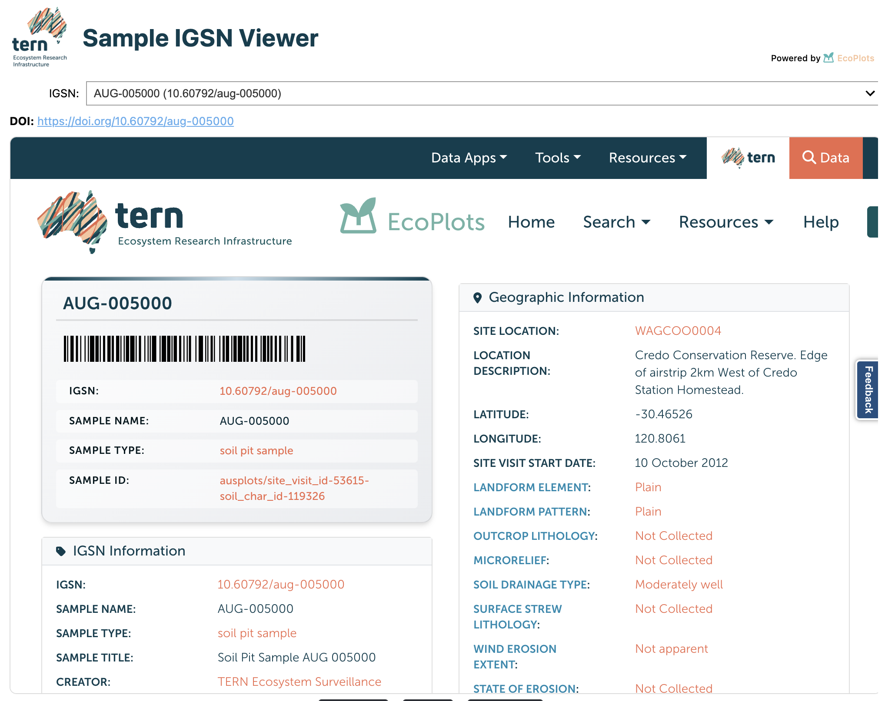
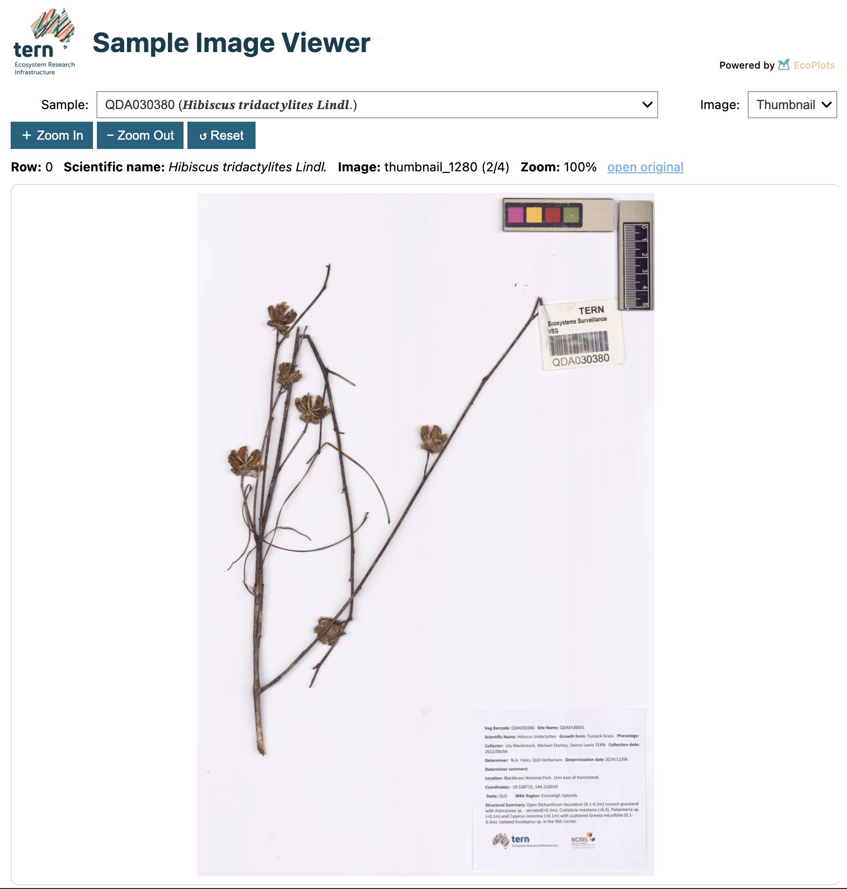

EcoPlots Samples Workflow
=========================

The ``EcoPlots`` client in **samples** mode lets you discover and retrieve
physical specimen samples collected during field surveys — including soil,
plant tissue, and plant voucher specimens — along with associated metadata
such as IGSN identifiers and sample images.

.. code-block:: python

   from terndata.ecoplots import EcoPlots

   ec = EcoPlots("samples")                              # enable samples mode
   ec.select(material_sample_type="Soil Pit Sample")     # pick a sample type
   ec.preview()
   df = ec.get_data(dformat="pd")                        # returns a DataFrame

.. note::

   All methods on this page are available on both
   :class:`~terndata.ecoplots.ecoplots.EcoPlots` (synchronous) and
   :class:`~terndata.ecoplots.ecoplots.AsyncEcoPlots` (asynchronous).
   For ``AsyncEcoPlots``, use ``df = await ec.get_data(dformat="pd")`` in the
   final step, or ``async for chunk in ec.get_data_stream(...)`` for streaming
   workflows.

.. note::

   In ``samples`` mode the **TERN Ecosystem Surveillance** dataset is always
   applied automatically. You cannot remove it; it is required for all sample
   queries.

.. note::

   A runnable walkthrough of all samples-mode features is available in the
   `Samples Demo Notebook <https://github.com/ternaustralia/terndata.ecoplots/blob/main/examples/demo_samples.ipynb>`_.

.. currentmodule:: terndata.ecoplots.ecoplots

----

Creating the Client
-------------------

.. code-block:: python

   from terndata.ecoplots import EcoPlots

   # Pass samples mode at creation time
   ec = EcoPlots("samples")

   # Case and close spellings are resolved automatically
   ec = EcoPlots("SAMPLE")

   # Or reload a saved samples project
   ec = EcoPlots.load("my_samples.ecoproj")

----

Selectables & Discoverable Facets
----------------------------------

Filters passed to ``select()`` are called **facets**. The table below lists
every facet available in samples mode, what it represents, and the discovery
method you can call to see valid values for it.

.. list-table::
   :header-rows: 1
   :widths: 25 16 39 20

   * - Facet
     - Type
     - Description
     - Discover with
   * - ``material_sample_type``
     - str
     - Sample type. Exactly one must be selected before calling
       ``get_data()``. See ``get_material_sample_types()`` for all
       available types.
     - ``get_material_sample_types()``
   * - ``dataset``
     - str / list
     - Dataset. Fixed to *TERN Ecosystem Surveillance* — applied
       automatically and cannot be removed.
     - ``get_datasources()``
   * - ``site_id``
     - str / list
     - One or more site identifiers.
     - ``get_sites()``
   * - ``region_type``
     - str
     - Category of geographic region (e.g. ``"bioregions"``, ``"states"``).
       Must be provided before or alongside ``region``.
     - ``get_region_types()``
   * - ``region``
     - str / list
     - Region name(s) within the chosen ``region_type``.
     - ``get_regions()``
   * - ``speciesname``
     - str / list
     - Species name. Applicable to plant tissue and voucher sample types only.
     - ``get_speciesname()``
   * - ``soil_subsite_id``
     - int / list[int]
     - Soil sub-site identifier(s). Applicable to soil sample types only.
     - ``get_soilpit()``
   * - ``soil_depth_range``
     - [min, max]
     - Filter samples by soil depth in metres. Applicable to soil sample
       types only.
     - ``get_soil_depth_range()``
   * - ``has_image``
     - bool
     - If ``True``, limit results to samples that have attached photographs.
     - — *(pass* ``True`` *or* ``False``\ *)*
   * - ``spatial``
     - WKT / GeoJSON
     - Spatial bounding geometry to restrict results geographically.
       Set interactively via ``select_spatial()``, or pass a WKT string
       or GeoJSON geometry ``dict`` directly.
     - ``select_spatial()`` *(widget)*

----

Discovery Methods
-----------------

Use these methods to explore what samples data is available *before* downloading.
All return :class:`pandas.DataFrame` and respect your current filters.

Material Sample Types
~~~~~~~~~~~~~~~~~~~~~

.. automethod:: EcoPlots.get_material_sample_types
   :no-index:

**Available types**

.. list-table::
   :header-rows: 1
   :widths: 35 65

   * - Label
     - Description
   * - ``Plant Tissue Sample``
     - Subsampled tissue taken from a collected plant
   * - ``Plant Voucher Specimen``
     - Full pressed herbarium voucher specimen (may have images)
   * - ``Soil Pit Sample``
     - Bulk soil sample from a defined pit depth
   * - ``Soil Subsite Sample``
     - Replicate soil samples from sub-locations within a site
   * - ``Soil Metagenomic Sample``
     - DNA-grade soil sample for metagenomic analysis

**Example**

.. code-block:: python

   ec.get_material_sample_types()

Datasets
~~~~~~~~

.. automethod:: EcoPlots.get_datasources
   :no-index:

Sites
~~~~~

.. automethod:: EcoPlots.get_sites
   :no-index:

**Example**

.. code-block:: python

   ec.get_sites()

   # Include region memberships as one column per region type
   ec.get_sites(include_region=True)

Regions
~~~~~~~

.. automethod:: EcoPlots.get_region_types
   :no-index:

.. automethod:: EcoPlots.get_regions
   :no-index:

Species Names
~~~~~~~~~~~~~

.. automethod:: EcoPlots.get_speciesname
   :no-index:

**Example** (*requires Plant Tissue Sample or Plant Voucher Specimen selected*)

.. code-block:: python

   ec.select(material_sample_type="Plant Voucher Specimen")
   ec.get_speciesname()

----

Filter Methods
--------------

All filter methods return ``self`` for chaining.

.. automethod:: EcoPlots.select
   :no-index:

.. automethod:: EcoPlots.remove
   :no-index:

.. automethod:: EcoPlots.clear
   :no-index:

.. automethod:: EcoPlots.get_filter
   :no-index:

.. automethod:: EcoPlots.get_api_query_filters
   :no-index:

**Samples-specific filter options**

The following extra keyword arguments are accepted by ``select()`` only in
``samples`` mode:

.. list-table::
   :header-rows: 1
   :widths: 28 18 54

   * - Keyword
     - Type
     - Description
   * - ``material_sample_type``
     - ``str``
     - Filter to a specific sample type (see table above).
   * - ``has_image``
     - ``bool``
     - If ``True``, limit to samples that have attached photographs.
   * - ``soil_subsite_id``
     - ``int`` or ``list[int]``
     - Restrict to specific soil sub-site identifiers.
   * - ``soil_depth_range``
     - ``[min, max]`` or ``{"min": x, "max": y}``
     - Restrict samples by soil depth in metres.

**Example**

.. code-block:: python

   ec.select(
       material_sample_type="Soil Pit Sample",
       soil_depth_range=[0.0, 0.5],
   )

   # Filter to samples with images only
   ec.select(
       material_sample_type="Plant Voucher Specimen",
       has_image=True,
   )

.. note::

   Exactly **one** ``material_sample_type`` must be selected before calling
   ``get_data()`` in samples mode.

----

IGSN Identifiers
----------------

Every sample in the TERN Ecosystem Surveillance program is registered with the
`International Geo Sample Number <https://www.igsn.org>`_ (IGSN) system and
assigned a persistent DOI. The IGSN DOI landing page for a sample is its
authoritative record — it displays the officially registered attributes for that
sample, including collection date, location, sample type, and parentage.

``get_sample_igsn()`` returns a DataFrame of sample names paired with their
IGSN DOIs. ``view_sample_igsn()`` opens an interactive widget with an embedded
iframe that loads the DOI landing page for any sample you select from a dropdown.
Install with ``pip install "terndata.ecoplots[gui]"`` before using widget
methods.

.. automethod:: EcoPlots.get_sample_igsn
   :no-index:

.. automethod:: EcoPlots.view_sample_igsn
   :no-index:

**Example**

.. code-block:: python

   # Retrieve IGSN DOIs for the currently filtered samples
   ec.get_sample_igsn()

   # Open the IGSN viewer widget — choose a sample to load its
   # DOI landing page (registered attributes) in the embedded iframe
   ec.view_sample_igsn()

   # Or navigate directly to a known sample's landing page
   ec.view_sample_igsn(igsn="10.60792/AUSM-0017401")

    The IGSN viewer widget. Choose a sample from the dropdown to load its
    IGSN DOI landing page — displaying the officially registered attributes
    for that sample — in the embedded iframe.

----

Soil Analysis
-------------

.. automethod:: EcoPlots.get_soil_depth_range
   :no-index:

.. automethod:: EcoPlots.get_soilpit
   :no-index:

**Example** (*requires a soil material sample type to be selected*)

.. code-block:: python

   ec.select(material_sample_type="Soil Pit Sample")

   # Aggregated depth-range summary as a GeoDataFrame
   ec.get_soil_depth_range()

   # Soil pit distribution counts
   ec.get_soilpit()

----

Sample Image Viewer
-------------------

For samples that have photographs attached, ``view_sample_images()`` opens an
interactive viewer. Each image may be available in multiple resolutions — the
viewer lets you select the resolution you want to display.
Install with ``pip install "terndata.ecoplots[gui]"`` before using widget
methods.

.. automethod:: EcoPlots.view_sample_images
   :no-index:

**Example**

.. code-block:: python

   ec.select(
       material_sample_type="Plant Voucher Specimen",
       has_image=True,
   )
   ec.view_sample_images()   # fetches data and opens the image viewer widget

    The sample image viewer widget. Navigate through specimen photos
    using the previous/next controls.

----

Spatial Filter Widget
---------------------

Draw a polygon or rectangle on a map to restrict results to a geographic area.
Install with ``pip install "terndata.ecoplots[gui]"`` before using widget
methods.

.. automethod:: EcoPlots.select_spatial
   :no-index:

**Example**

.. code-block:: python

   ec.select_spatial()

----

Data Preview & Retrieval
------------------------

.. automethod:: EcoPlots.summary
   :no-index:

.. automethod:: EcoPlots.preview
   :no-index:

.. automethod:: EcoPlots.get_data
   :no-index:

.. automethod:: EcoPlots.export_data
   :no-index:

**Typical workflow**

.. code-block:: python

   # 1. Confirm there are matching records
   ec.summary()

   # 2. Quick preview before full download
   ec.preview()

   # 3. Download the full dataset
   df  = ec.get_data(dformat="pd")   # pandas DataFrame
   gdf = ec.get_data()               # GeoDataFrame (default)
   pq  = ec.get_data(dformat="pq")   # Parquet bytes

   ec.export_data("outputs/samples.parquet")
   ec.export_data("outputs/samples.csv")

.. note::

   In ``samples`` mode ``get_data()`` does **not** support the
   ``"geojson"`` / ``"json"`` formats. Use ``"pd"``, ``"gpd"``, or ``"pq"``.

**Async streaming**

.. code-block:: python

   from terndata.ecoplots import AsyncEcoPlots

   ec = AsyncEcoPlots("samples")
   ec.select(material_sample_type="Plant Voucher Specimen")

   async for gdf in ec.get_data_stream(dformat="gpd"):
       ...

   async for parquet_bytes in ec.get_data_stream(dformat="pq"):
       ...

----

Project Save / Load
-------------------

.. automethod:: EcoPlots.save
   :no-index:

.. automethod:: EcoPlots.load
   :no-index:

**Example**

.. code-block:: python

   path = ec.save("soil_pit_survey.ecoproj")

   # Reload — mode and all filters are fully restored
   ec2 = EcoPlots.load(path)
   ec2.get_filter()
